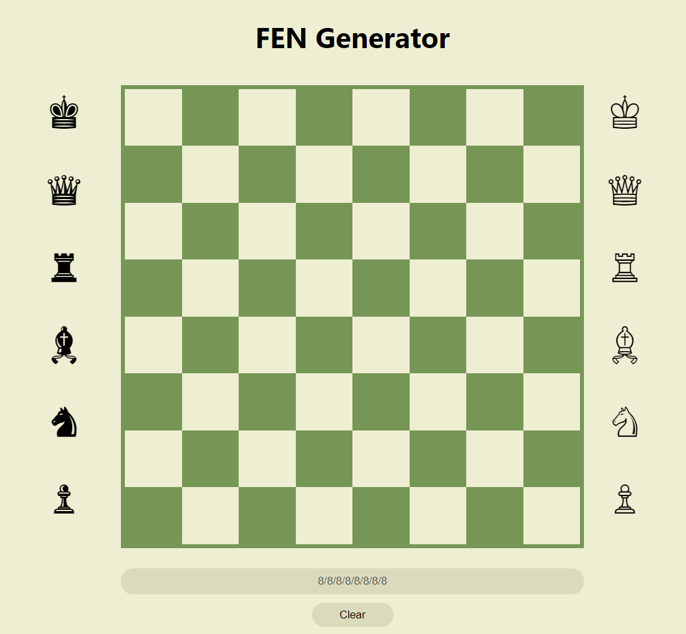
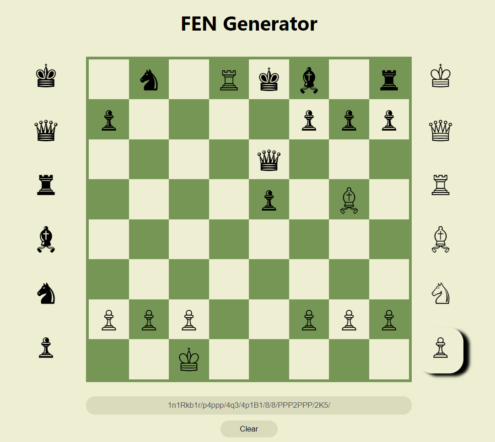

# FEN-Generator

## Table of contents
* [General info](#general-info)
* [Technologies](#technologies)
* [Features](#features)
* [Screenshots](#screenshots)

## General info
FEN is the abbreviation of Forsyth-Edwards Notation and it is the standard notation to describe positions of a chess game.
This program turns chess positions into FEN. It's the continuation of [FEN-Reader](https://https://github.com/P1TR13/FEN-reader).
	
## Technologies
Project is created with:
* JavaScript
* CSS3
* HTML5

## Features
* Turn chess position into FEN
#### To do:
* Drag pieces on the board using cursor

## Screenshots
#### User Interface

#### Using FEN Generator

